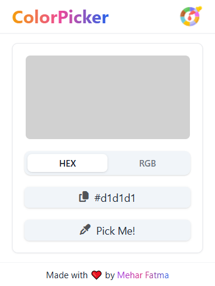
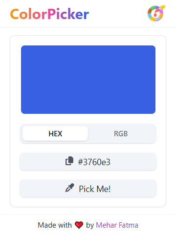

# ColorPicker

**Version:** 0.1.0  
**Author:** Mehar Fatma

## Overview

ColorPicker is a simple and intuitive browser extension that allows you to easily select and copy colors directly from your browser screen. Whether you're a web designer, developer, or just someone who loves colors, this tool provides a seamless way to grab color without needing external tools.

## Features

- Easy-to-use interface with a clean design
- Pick colors from any part of your browser screen
- Lightweight

## Screenshots






## Prerequisites

Make sure you have the following installed on your machine:

- [Node.js](https://nodejs.org/)
- [npm](https://www.npmjs.com/)

## Installation Setup

1. **Clone the repository:**

   ```bash
   git clone https://github.com/itsmeharfatma/ColorPicker-Extension.git

   cd ColorPicker-Extension
   ```

2. **Install dependencies:**

   ```bash
   npm install
   ```

3. **Building the Extension:**

   ```bash
   npm run build
   ```

4. The build will be generated in the build/ directory.

5. Navigate to chrome://extensions/ in your browser.

6. Enable Developer mode (toggle it on in the top right corner).

7. Click on Load unpacked and select the folder containing the project.

8. Load the build/ directory into your browser’s extension manager as an unpacked extension.

9. The ColorPicker extension will now be installed and available for use.

## How to Use

1. Click on the ColorPicker icon in your browser toolbar.

2. A popup window will appear with the color picker interface.

3. Hover over any area of the screen to pick a color.

4. The selected color will be displayed for easy copying.
